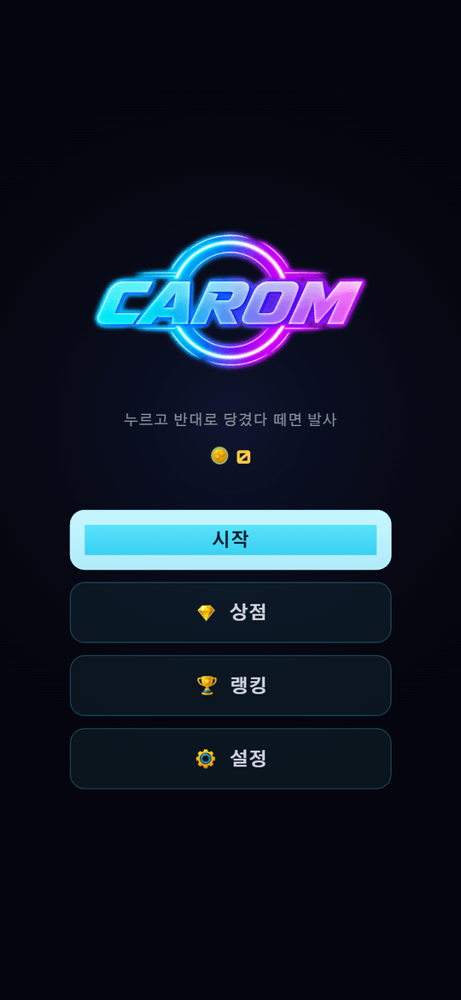
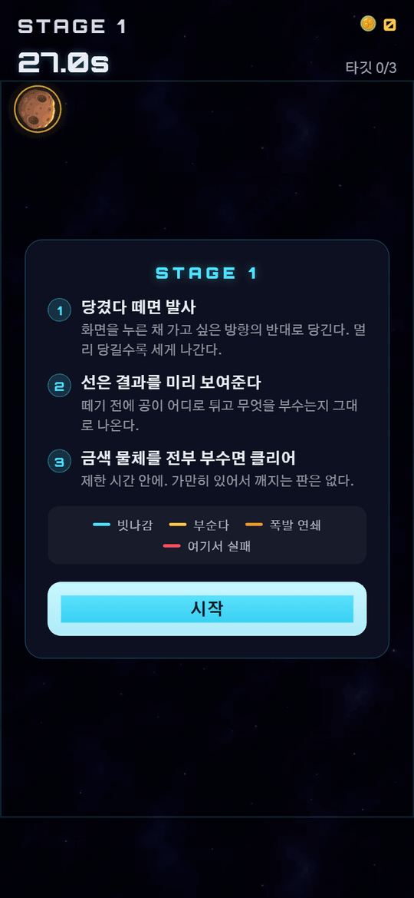
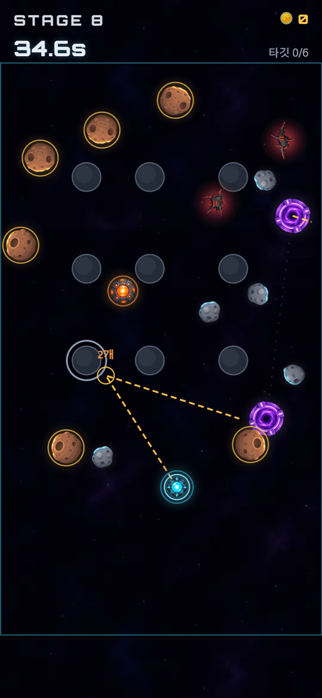
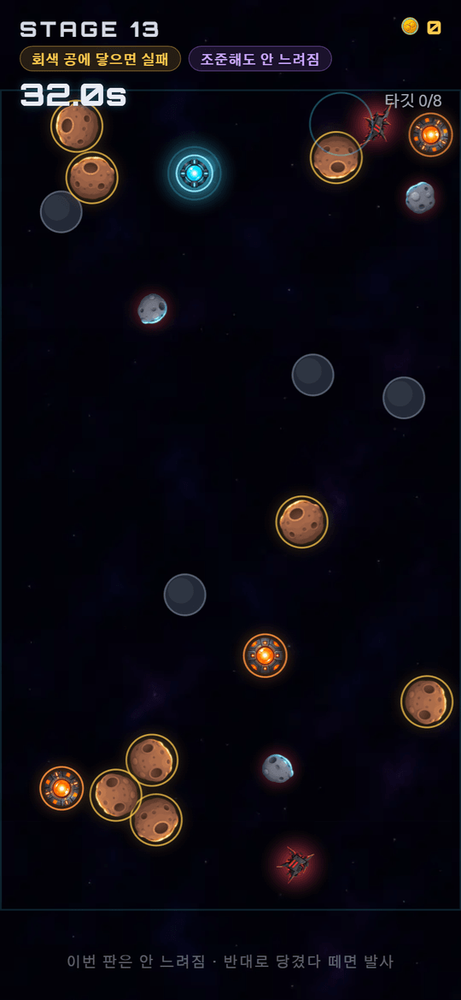
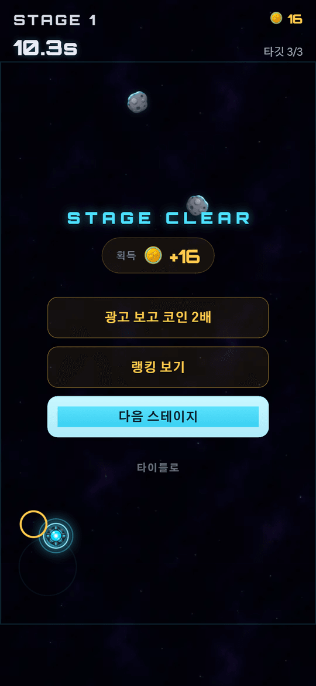
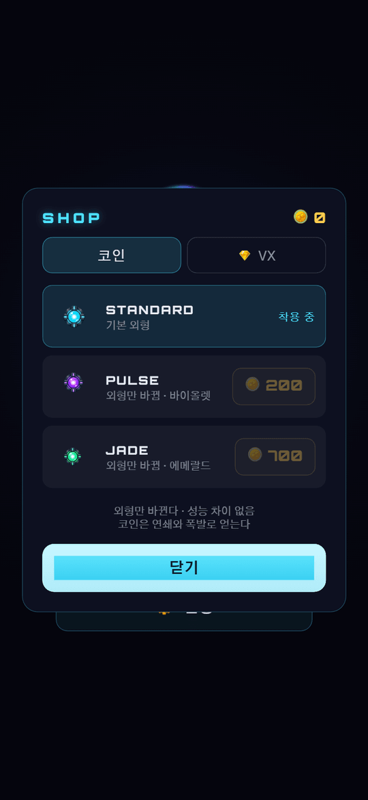
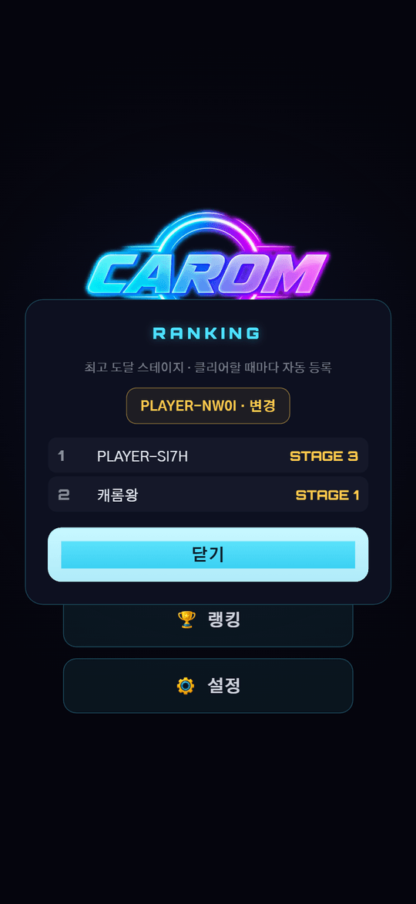

# CAROM

> 멈추지 않는 당구대에서, 한 번의 샷으로 미래를 읽는다.

우주를 배경으로 한 세로 9:16 모바일 2D 당구 퍼즐입니다. 조작은 화면을 누르고 당겼다 떼는 것 하나뿐이고,
Verse8(Agent8) 플랫폼에 배포해 설치 없이 브라우저에서 바로 돌아갑니다.

**▶ 플레이: https://verse8.io/v3W2h9p**



## 어떤 게임인가

닫힌 아레나 안에서 큐볼과 공들이 벽과 서로에게 계속 튕깁니다. **아무것도 멈추지 않습니다.**
화면을 누른 채 가고 싶은 방향의 **반대로** 당겼다 떼면 그 방향으로 발사됩니다(새총). 멀리 당길수록 세게 나갑니다.

- 누르는 동안 물리가 0.18배로 느려져 각을 읽을 수 있습니다. 대신 **제한 시간은 실제 속도로 흐릅니다** — 오래 조준하면 그만큼 손해입니다.
- 손가락이 항상 발사 방향 반대편에 있어 조준선을 가리지 않습니다.
- 금색 타깃을 전부 부수면 클리어. 실패는 둘뿐 — 위험물 접촉, 시간 초과. **샷 횟수 제한은 없습니다.**
- 시작 1.4초는 무적입니다. 오브젝트가 20개를 넘으면 배치가 아무리 조심스러워도 공이 흘러와 닿는데, 첫 샷도 못 쏘고 지는 것은 플레이어의 실수가 아니니까요.



### 조준선이 이 게임의 얼굴입니다



떼기 전에 공이 어디로 튀고 무엇을 부수는지 **그대로** 나옵니다. 근사치가 아니라 정확한 미래입니다.
벽 튕김, 공 튕김, 타깃 파괴, 폭발 연쇄, 포탈 통과까지 전부 반영됩니다.

**색이 곧 판정입니다.**

| 색 | 뜻 |
|---|---|
| 🟡 금색 | 타깃을 부순다 |
| 🟠 주황 | 폭발 연쇄가 터진다 |
| 🔴 빨강 | 여기서 실패한다 |
| 🔵 파랑 | 아무 일도 없다 |

선은 **2선분까지만** 그립니다. 만파워로 쏘면 3초에 대여섯 번 튕겨 화면이 선으로 덮이기 때문입니다.
다만 **그리는 것만 자르고 계산은 끝까지 합니다** — 큐볼이 튕긴 뒤에 결과가 나오는 샷(`bankShot`)을 확인할 수 없게 되면 곤란하니까요.
경로 끝에서 실패하는 경우도 반드시 알려줍니다. 첫 충돌만 보면 "타깃 맞히고 튕겨서 죽는" 샷이 안전해 보입니다.

### 화면에 있는 것

| 보이는 것 | 역할 | 규칙 |
|---|---|---|
| 시안 발광 구슬 | **큐볼** | 절대 안 멈춤 |
| 금색 링 두른 소행성 | **타깃** | 부숴야 할 것 |
| 빨간 각진 금속 | **위험물** | 닿으면 즉시 실패. 못 부숨 |
| 회색 파편 | **중립구** | 각을 만드는 공. 큐볼에 맞으면 1.6초간 충전되고, 그 상태로 타깃을 치면 부숨 |
| 주황 캐니스터 | **폭발통** | 반경 135 안 타깃 일괄 파괴, 다른 폭발통도 연쇄 |
| 무채색 기둥 | **벽** | 안 움직이고 안 부서짐. 당구대의 모양을 바꿈 |
| 보라 링 쌍 | **포탈** | 큐볼만 통과. 양방향, 0.35초 재진입 금지 |

발광을 주면 공으로 보이고, 공으로 보이면 부술 수 있다고 착각합니다. 그래서 **벽만 무채색**입니다.

### 스테이지는 번호 하나에서 전부 유도됩니다



손으로 만든 레벨 데이터가 없습니다. 같은 번호는 항상 같은 판이라 재도전이 성립합니다.
세 축이 **서로 다른 주기로** 돌아 조합이 곱해집니다 — 최소공배수 **126**.

- **조건(6주기)** — `destroyAll`(전부 파괴) · `noNeutral`(중립구에 닿으면 실패) · `bankShot`(큐볼로 직접 못 부숨) · `inOrder`(번호 순서대로만)
- **테마(9주기)** — `open` `pillars` `corridor` `barrier` `scatter` `cross` `ring` `funnel` `columns`
- **모디파이어(7주기)** — `swift`(속도 ×1.35) · `shortLine`(조준선 1선분) · `tightTime`(시간 ×0.62) · `noSlow`(조준해도 안 느려짐)

도입 시점도 어긋나게 뒀습니다 — 위험물 3, 폭발통 5, 조건 7, 포탈 8, 모디파이어 10스테이지부터. 한 번에 다 나오면 배우지 못합니다.

### 그 밖에

<p>



</p>

- **랭킹** — 최고 도달 스테이지 기준. 클리어할 때마다 **자동 등록**됩니다.
- **상점** — 코인으로 사는 큐볼 스킨(성능 차이 없음), VX로 사는 광고 제거.
- **보상형 광고 2개** — 실패 시 시간 +12초, 클리어 시 코인 2배. 전면 광고는 쓰지 않습니다.
- **4개 언어** — 한국어 · English · 简体中文 · 繁體中文.
- **소리는 파일이 아니라 합성입니다.** 배경음도 효과음도 Web Audio로 그 자리에서 만듭니다 — 루프 파일을 쓰면 몇 MB가 붙고, 짧게 자르면 반복이 금방 들킵니다.

---

## 이 프로젝트에서 봐줬으면 하는 것

### 1. 조준선이 거짓말하지 않게 만드는 세 개의 경계

조준선은 상태를 통째로 복제해 실제와 똑같은 물리·규칙으로 빨리 감아 그립니다. 그래서:

- **시뮬레이션은 결정적이다.** 같은 시드 + 같은 입력열 → 같은 결과. 난수는 시드 기반(`rng.ts`)만 쓰고, `Math.random()`은 새 판을 시작할 때만 씁니다. 루프는 고정 timestep 1/60 — 가변 timestep을 쓰면 프레임 드랍마다 결과가 달라집니다.
- **규칙 구현은 `rules.ts` 하나뿐이다.** 엔진과 조준선이 같은 함수를 호출합니다. 규칙이 두 벌이면 조준선이 거짓말합니다 — 실제로 그 사고를 냈습니다(금색 타깃이 안 부서지던 버그).
- **`renderer.ts`는 상태를 읽고 그리기만 한다.** 그래서 아트 교체가 물리를 건드릴 수 없습니다.

비용은 실측했습니다. 물체 25개 기준 데스크톱 0.10ms, 모바일 환산 약 0.5ms — 프레임 예산의 3%라 캐싱하지 않습니다.

### 2. 접촉 판정을 추측하지 않는다

충돌 해소가 두 원을 정확히 맞닿는 거리로 밀어내므로, **그 뒤에** 겹침을 재면 경계값에서 부동소수점에 따라 참/거짓이 갈립니다.
그래서 물리가 실제로 해소한 충돌을 그 순간 기록해 두고, 게임 판정은 그 목록만 봅니다.
"얼마나 겹쳐야 닿은 것인가"라는 질문 자체를 없앴습니다.

### 3. 모순되는 조합은 생성 단계에서 막는다

절차적 생성이라 규칙끼리 부딪히는 판이 나올 수 있습니다. 그건 만들기 전에 잘라냅니다.

- `inOrder`에는 폭발통 0 — 한 방에 여러 개를 부수면 순서를 지킬 방법이 없습니다.
- `inOrder`는 타깃 5개 상한 — 매 샷이 특정 한 개를 노려야 해서 곱으로 어려워집니다.
- `noNeutral`은 중립구·위험물 절반 — 둘 다 치명적이면 지나갈 틈이 없습니다.
- `bankShot`은 중립구 최소 3 — 거쳐 갈 것이 없으면 풀 수 없습니다.
- `barrier` 테마는 벽이 아레나를 **틈 없이** 가르고 포탈을 강제 1개. 틈을 하나라도 남기면 포탈이 지름길이 아니라 선택지가 되고, 이 테마가 존재할 이유가 사라집니다.

**측정값** — 서로 다른 설계 108가지, 처음 겹치는 지점 44스테이지, 봇 클리어율 29/30, 무입력 클리어 0/20(수동적 최적해 없음).

### 4. 밸런스를 감으로 찍지 않는다

`npm run sim`이 봇으로 30스테이지를 깨면서 코인 수급을 같이 잽니다. 가격은 금액이 아니라 **도달 시점**으로 정했습니다.

| 가격 | 100 | 200 | 300 | 500 | 700 |
|---|---|---|---|---|---|
| 도달 스테이지 | 5 | 8 | 10 | 15 | 20 |

이 측정으로 실제 버그를 잡았습니다. 처음에는 연쇄·폭발 보너스만 있어서 한 번에 하나씩 깔끔하게 부수면 **깨고도 0코인**이었고(1·5·19스테이지가 0),
그때 "코인 2배" 광고 버튼이 2배로 만들 것이 없어 잠겼습니다. 클리어 보상 `10 + 타깃수 × 2`를 추가해 해결했습니다.

이어하기 가격은 `60 + 20 × ⌊(stage-1)/10⌋`입니다. 지키려는 것은 금액이 아니라 **중앙값 수입의 1.5판치**라는 비율입니다 —
코인은 클리어할 때만 들어오므로, 실패가 잦은 초반에 낼 수 없는 값을 매기면 버튼이 아예 안 뜹니다. **못 사는 가격은 가격이 아닙니다.**

### 5. 재화는 서버가 소유한다

실제 결제가 얽힌 이상 클라이언트가 재화를 소유하는 구조는 둘 수 없습니다 — localStorage는 고치면 그만입니다.
스킨 가격은 서버 표(`SKIN_PRICES`)가 정하고 클라이언트가 보낸 가격은 받지 않습니다.
VX 상품 지급은 오직 `$onItemPurchased`만 하고, 같은 `purchaseId`가 두 번 와도 한 번만 반영합니다.

서버에 연결되지 않으면 로컬로 돌아갑니다 — 서버가 없다고 게임이 멈추면 안 되니까요. 그때 번 것은 처음 연결될 때 `migrateLocal`로 **한 번만** 올라갑니다.

**막지 못하는 것도 적어 뒀습니다.** 클라이언트가 도달 스테이지를 부풀려 보내는 것, 조작한 `requestId`로 광고 보상을 요청하는 것.
완전히 막으려면 서버가 시뮬레이션을 재현해야 하는데 범위 밖입니다. 스테이지당 상한(`MAX_COINS_PER_STAGE = 200`)으로 무제한 발급만 잘라냈습니다.

### 6. 플랫폼이 못 해주는 것을 알아내는 데 시간을 썼다

Verse8은 광고 SSV 결과를 게임 서버에 열어주지 않습니다 — `POST /ads/verify`는 `401`, `GET /ads/status`는 `202` pending에 머뭅니다.

이걸 모르고 검증 실패를 거절로 처리했더니 **광고를 끝까지 본 사람이 매번 "보상을 확인하지 못했습니다"를 봤습니다.**
지금은 검증자가 명시적으로 "안 봤다"고 할 때만 거절합니다. 대답을 못 얻으면 지급합니다 — 플랫폼이 침묵한다고 광고를 본 사람을 빈손으로 보낼 수는 없습니다.

---

## 기술 스택

| 영역 | 사용 기술 |
|---|---|
| 클라이언트 | React 18, TypeScript 5.7, Vite 6 |
| 렌더링 | Canvas 2D 직접 호출 (게임 프레임워크 없음) |
| 스타일 | 순수 CSS + 커스텀 프로퍼티 (Tailwind 없음) |
| 서버 | Verse8/Agent8 `server.js` — 지갑 · 랭킹 · 보상 검증 |
| 플랫폼 | `@verse8/ads`(보상형 광고), `@verse8/platform`(VX 결제) |
| 검증 | 결정적 시뮬레이션 기반 봇 — 클리어율 · 코인 수급 · 무입력 클리어 검사 |

게임 프레임워크는 쓰지 않았습니다. 원 20개짜리 물리에 프레임워크를 얹으면 의존성 리스크만 늘고 얻는 게 없습니다. TS/TSX 약 5,900줄.

```
├── server.js                  # Agent8 서버 함수 (루트, export 금지)
└── src/
    ├── game/
    │   ├── config.ts          # 튜닝 숫자 전부 여기 한 곳
    │   ├── engine.ts          # 시뮬레이션 (결정적)
    │   ├── physics.ts         # 원-원 충돌, 벽, 포탈
    │   ├── rules.ts           # 파괴·폭발·연쇄 규칙의 유일한 구현
    │   ├── foresight.ts       # 조준선
    │   ├── shot.ts            # 당김 → 임펄스 변환
    │   ├── stage.ts           # 번호 → 스테이지
    │   ├── rng.ts             # 시드 기반 난수
    │   ├── assets.ts          # 알파 바운딩박스 기준 스프라이트 정규화
    │   └── renderer.ts        # Canvas 2D (읽기 전용)
    ├── audio/                 # 배경음 · 효과음
    ├── hooks/                 # useGameLoop(rAF + 고정 timestep) · useRanking · useWallet · useAdReward
    ├── net/                   # leaderboard · ads
    ├── i18n/                  # 한국어 · English · 简体 · 繁體
    └── ui/                    # Title / Game / Leaderboard / Shop / Settings / Tutorial
```

## 실행

```bash
npm install
npm run dev
```

`?stage=N` 쿼리로 타이틀을 건너뛰고 특정 스테이지를 바로 열 수 있습니다.

```bash
npm run build     # tsc -b && vite build
npm run preview
```

배포는 `npx -y @agent8/deploy`.

### 검증 도구

전부 결정적 시뮬레이션 덕분에 가능합니다.

```bash
npm run sim                        # 봇이 30스테이지를 실제로 깨보는 검증 + 코인 수급 측정
npx tsx scripts/idle-check.ts      # 무입력으로 클리어되는지 (수동적 최적해 검사)
npx tsx scripts/cycle-check.ts     # 설계 종류 · 반복 지점
npx tsx scripts/stage-table.ts     # 스테이지별 구성표
npx tsx scripts/perf-foresight.ts  # 조준선 계산 비용
```

## 문서

- [`docs/design.md`](docs/design.md) — 설계 문서. 위 내용의 전문(全文)이며 **왜 그렇게 했는지**가 전부 적혀 있습니다.
- [`PROJECT/`](PROJECT/) — 컨텍스트 · 요구사항 · 현황 · 구조
- [`docs/asset-prompts.md`](docs/asset-prompts.md) — 아트 생성 프롬프트

## 환경 변수

`.env`에 Verse8 계정 식별자가 들어갑니다. `VITE_` 접두사라 클라이언트 번들에 포함되는 공개 값입니다.

```
VITE_AGENT8_ACCOUNT=<account address>
VITE_AGENT8_VERSE=<verse address>
```
